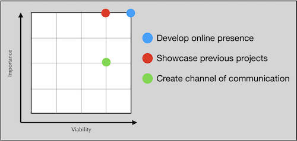
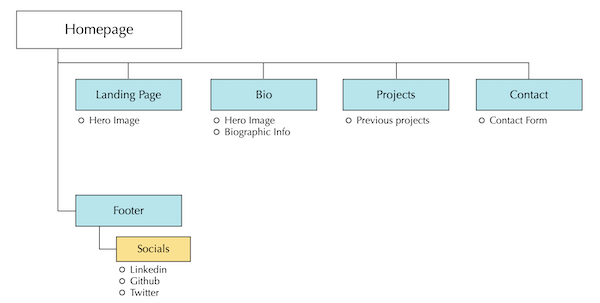
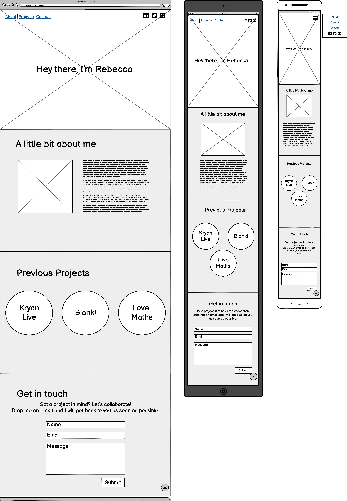

<p align="center">

</p>

<h3 align="center">
A Software Development student based in Dublin, Ireland. <br>
<strong>Welcome to my <a href="">Portfolio</a>!</strong>
</h3>

## Table of contents
1. [Introduction](#Introduction)
2. [UX](#UX)
    1. [Ideal User Demographic](#Ideal-User-Demographic)
    2. [User Stories](#User-Stories)
    3. [Development Planes](#Development-Planes)
3. [Features](#Features)
    1. [Design Features](#Design-Features) 
    2. [Existing Features](#Existing-Features)
    3. [Features to Implement in the future](#Features-to-Implement-in-the-future)
4. [Known Issues and Bugs](#Known-Issues-and-Bugs)
5. [Technologies Used](#Technologies-Used)
     1. [Main Languages Used](#Main-Languages-Used)
     2. [Additional Languages Used](#Additional-Languages-Used)
     3. [Frameworks, Libraries & Programs Used](#Frameworks,-Libraries-&-Programs-Used)
6. [Testing](#Testing)
     1. [Testing.md](TESTING.md)
7. [Deployment](#Deployment)
     1. [Deploying on GitHub Pages](#Deploying-on-GitHub-Pages)
     2. [Forking the Repository](#Forking-the-Repository)
     3. [Creating a Clone](#Creating-a-Clone)
8. [Credits](#Credits)
     1. [Content](#Content)
     2. [Media](#Media)
     3. [Code](#Code)
9. [Acknowledgements](#Acknowledgements)
***

## Introduction

This fully responsive website was designed by, and for, Rebecca Tracey-Timoney, a software developer in training. The focus of the site is to create an online presence for the developer, allowing others to find out more about the developer, including her previous projects, and how to get in contact for future ones. 

[Back to top ⇧](#table-of-contents)

## UX 

### User Stories
#### As a visitor, I want to:
1. Easily navigate through the website to find the relevant content, effortlessly.
2. Learn about the developer's background in order to find out more about them.
3. Easily navigate to previous projects of the developer, to learn about their style of work.
4. Easily find a point of contact in order to get in touch with the developer.

### Development Planes

The developer distinguished the required functionality of the site and how it would answer the user stories, as described above, using the Five Development Planes:

#### Strategy
Broken into three categories, the website will focus on the following target audiences:
- **Roles:**
     - New/Potential Clients
     - Current/Return Clients

- **Demographic:**
     - 18+
     - Interest in collaborating with the developer

- **Psychographics:**
     - Personality & Attitudes:
          - Friendly
          - Outgoing
     - Values:
          - More modern lifestyle
          - Importance of online presence
     - Lifestyles:
          - Business-oriented
          - Client-focused

The website needs to enable the **user** to:
- Retrieve desired information:
     - Biographical information
     - Previous projects
     - Contact information

The website needs to enable the **developer** to:
- Develop an online presence 
- Provide an easily navigable website for users to find relevant information:
     - Projects
     - Biographical information
- Provide a channel of communication for enquires

With these goals in mind, a strategy table was created to determine the trade-off between importance and viability with the following results:

<p align="center">

</p>

#### Scope
A scope was defined in order to clearly identify what needed to be done in order to align features with the strategy previously defined. This was broken into two categories:
- **Content Requirements**
     - The user will be looking for:
          - Biographic information
          - Projects
          - Contact details
- **Functionality Requirements**
     - The user will be able to:
          - Easily navigate through the site in order to find the information they want
          - Contact the developer directly through their chosen channel of communication

#### Structure
The information architecture was organized in a **hierarchial tree structure** in order to ensure that users could navigate through the site with ease and efficiency, with the following results: 

<p align="center">

</p>

#### Skeleton 
Low-Fidelity Wireframe mockups were created in [Balsamiq](https://balsamiq.com/ "Link to Balsamiq Website") with providing a positive user experience in mind:

<p align="center">

</p>


#### Surface

#### Colour Scheme


#### Typography


#### Imagery


[Back to top ⇧](#table-of-contents)

## Features

### Design Features

<dl>
  <dt></dt>
  <dd>
     <ul>
          <li><strong></strong> - </li>
          <li><strong></strong> - </li>
     </ul>
  </dd>
 
### Existing Features


### Features to Implement in the future

[Back to top ⇧](#table-of-contents)

## Known Issues and Bugs 


[Back to top ⇧](#table-of-contents)

## Technologies Used
### Languages Used
- [HTML5](https://en.wikipedia.org/wiki/HTML5 "Link to HTML Wiki")
- [CSS3](https://en.wikipedia.org/wiki/Cascading_Style_Sheets "Link to CSS Wiki")
- [JavaScript](https://en.wikipedia.org/wiki/JavaScript "Link to JavaScript Wiki")

### Frameworks, Libraries & Programs Used
- [Bootstrap](https://getbootstrap.com/docs/4.4/getting-started/introduction/ "Link to Bootstrap page")
     - Bootstrap was used to implement the responsiveness of the site, using bootstrap classes.
- [jQuery](https://jquery.com/ "Link to jQuery page")
     - jQuery was used to simplify the JavaScript code used.
- [Google Fonts](https://fonts.google.com/ "Link to Google Fonts")
    - Google fonts was used to import the fonts used throughout the project.
- [Font Awesome](https://fontawesome.com/ "Link to FontAwesome")
     - Font Awesome was used to import icons for UX purposes.
- [Git](https://git-scm.com/ "Link to Git homepage")
     - Git was used for version control by utilizing the GitPod terminal to commit to Git and push to GitHub.
- [GitHub](https://github.com/ "Link to GitHub")
     - GitHub was used to store the project after pushing.
- [jQuery Validation](https://jqueryvalidation.org/ "Link to jQuery Validation page")
     - jQuery Validation was used to simplify form validation for the **Suggestions Form**.
- [SweetAlert2](https://sweetalert2.github.io/ "Link to Sweet Alert 2 page")
     - SweetAlert2 was used to customise the **Suggestions Form** success message for UX purposes.
- [Animate on Scroll](https://michalsnik.github.io/aos/ "Link to Animate on Scroll page")
     - Animate on Scroll was used for scroll effects forr UI purposes.
- [Figma](https://www.figma.com/ "Link to Figma homepage")
     - Figma was used to create the wireframes during the design phase of the project.
- [Am I Responsive?](http://ami.responsivedesign.is/# "Link to Am I Responsive Homepage")
     - Am I Responsive was used in order to validate the responsiveness of the design throughout the process, and to generate mockup imagery to be used.

[Back to top ⇧](#table-of-contents)

## Testing

Testing information can be found in a separate testing [file](TESTING.md "Link to testing file")

## Deployment

This project was developed using [Visual Studio Code Insiders](https://code.visualstudio.com/insiders/ "Link to Visual Studio Code site"), committed to git and pushed to GitHub using the computer terminal.

### Deploying on GitHub Pages
To deploy this page to GitHub Pages from its GitHub repository, the following steps were taken:

1. Log into [GitHub](https://github.com/login "Link to GitHub login page") or [create an account](https://github.com/join "Link to GitHub create account page").
2. Locate the [GitHub Repository](https://github.com/rebeccatraceyt/Rebecca.TraceyTimoney "Link to GitHub Repo").
3. At the top of the repository, select Settings from the menu items.
4. Scroll down the Settings page to the "GitHub Pages" section.
5. Under "Source" click the drop-down menu labelled "None" and select "Master Branch".
6. Upon selection, the page will automatically refresh meaning that the website is now deployed.
7. Scroll back down to the "GitHub Pages" section to retrieve the deployed link.
8. At the time of submitting this Milestone project the Development Branch and Master Branch are identical.

### Forking the Repository
By forking the GitHub Repository we make a copy of the original repository on our GitHub account to view and/or make changes without affecting the original repository by using the following steps...

1. Log into [GitHub](https://github.com/login "Link to GitHub login page") or [create an account](https://github.com/join "Link to GitHub create account page").
2. Locate the [GitHub Repository](https://github.com/rebeccatraceyt/Rebecca.TraceyTimoney "Link to GitHub Repo").
3. At the top of the repository, on the right side of the page, select "Fork"
4. You should now have a copy of the original repository in your GitHub account.

### Creating a Clone
How to run this project locally:
1. Install the [GitPod Browser](https://www.gitpod.io/docs/browser-extension/ "Link to Gitpod Browser extension download") Extension for Chrome.
2. After installation, restart the browser.
3. Log into [GitHub](https://github.com/login "Link to GitHub login page") or [create an account](https://github.com/join "Link to GitHub create account page").
2. Locate the [GitHub Repository](https://github.com/rebeccatraceyt/Rebecca.TraceyTimoney "Link to GitHub Repo").
5. Click the green "GitPod" button in the top right corner of the repository.
This will trigger a new gitPod workspace to be created from the code in github where you can work locally.

How to run this project within a local IDE, such as VSCode:

1. Log into [GitHub](https://github.com/login "Link to GitHub login page") or [create an account](https://github.com/join "Link to GitHub create account page").
2. Locate the [GitHub Repository](https://github.com/rebeccatraceyt/Rebecca.TraceyTimoney "Link to GitHub Repo").
3. Under the repository name, click "Clone or download".
4. In the Clone with HTTPs section, copy the clone URL for the repository.
5. In your local IDE open the terminal.
6. Change the current working directory to the location where you want the cloned directory to be made.
7. Type 'git clone', and then paste the URL you copied in Step 3.
```
git clone https://github.com/USERNAME/REPOSITORY
```
8. Press Enter. Your local clone will be created.

Further reading and troubleshooting on cloning a repository from GitHub [here](https://docs.github.com/en/free-pro-team@latest/github/creating-cloning-and-archiving-repositories/cloning-a-repository "Link to GitHub troubleshooting")

[Back to top ⇧](#table-of-contents)

## Credits 

### Content

### Media

### Code 
The developer consulted multiple sites in order to better understand the code they were trying to implement. For code that was copied and edited, the developer made sure to reference this with the code. The following sites were used on a more regular basis:
- [Stack Overflow](https://stackoverflow.com/ "Link to Stack Overflow page")
- [W3Schools](https://www.w3schools.com/ "Link to W3Schools page")
- [Bootstrap](https://getbootstrap.com/ "Link to BootStrap page")
- [JSfiddle](https://jsfiddle.net/ "Link to JSfiddle page")

[Back to top ⇧](#table-of-contents)

***
